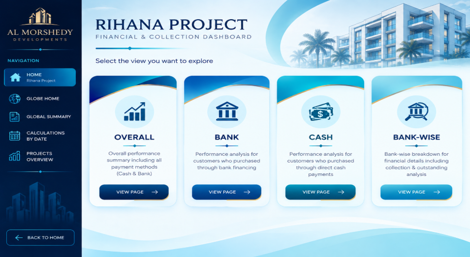
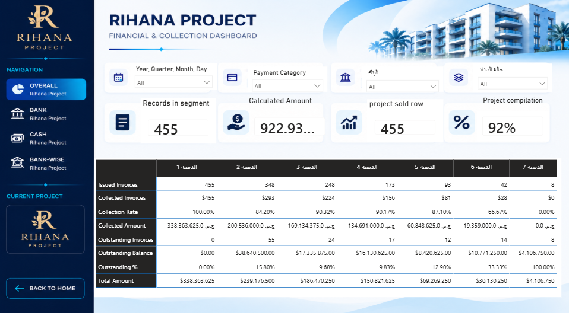
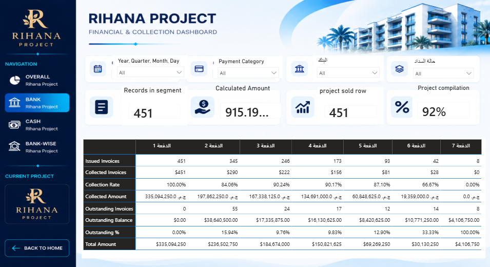
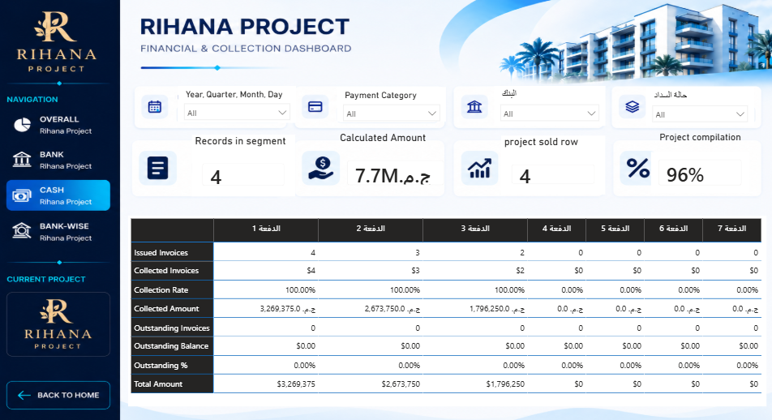

# Al-Morshedy Collection Analysis & Financial Risk Dashboard

A Power BI dashboard developed to analyze real-estate sales, collection performance, outstanding balances, payment methods, and financial indicators across multiple projects.

> **Team Graduation Project** — Developed by a team of 4 members as part of the Route Data Analysis Program.

---

## 📊 Project Overview

The **Al-Morshedy Collection Analysis & Financial Risk Dashboard** is an interactive Power BI solution designed to provide a clear view of collection performance across a real-estate project portfolio.

The dashboard enables users to monitor and analyze key financial and collection metrics, including:

- Sales and invoiced amounts
- Collected amounts
- Outstanding balances
- Collection performance
- Bank and cash payments
- Bank-wise analysis
- Installment-level performance
- Collection trends over time

The project includes both **global portfolio analysis** and **project-level dashboards**.

---

## 🎯 Project Objectives

The dashboard was designed to help users:

- Monitor collection performance across projects.
- Track collected and outstanding amounts.
- Compare project performance.
- Analyze **Bank vs. Cash** collections.
- Analyze collection performance by bank.
- Monitor installment-level payment performance.
- Track collection trends over time.
- Support data-driven financial decision-making.

---

## 🏗️ Dashboard Structure

The dashboard is divided into two main levels:

### Global Analysis

- Home
- Global Summary
- Collection by Date

### Project-Level Analysis

Each project contains dedicated analytical views:

- Home
- Overall
- Bank
- Cash
- Bank-Wise

---

# 🖥️ Dashboard Preview

## 🏠 Global Home

The main landing page provides navigation to the global analysis sections and different real-estate projects.


---

## 🌐 Global Summary

Provides an overall view of the project portfolio and key collection and financial metrics.


---

## 📅 Collection by Date

Analyzes collection performance over time and supports tracking collection and outstanding trends.


---

# 🏢 Crystal Plaza Maadi Compound

The following pages represent the Crystal Plaza Maadi Compound dashboard.

## Home


## Overall Analysis

Provides an overview of the project's collection and financial performance.


## Bank Analysis

Focuses on bank-related collection performance.


## Cash Analysis

Focuses on direct cash collection performance.


## Bank-Wise Analysis

Provides a detailed breakdown of collection performance by bank.


---

# 🏘️ Rihana Project

The following pages represent the Rihana project dashboard.

## Home



## Overall Analysis

Provides an overview of collection and financial performance for the Rihana project.



## Bank Analysis

Focuses on bank-related collection performance.



## Cash Analysis

Focuses on direct cash collection performance.



## Bank-Wise Analysis

Provides a detailed breakdown of collection performance by bank.


---

# 📈 Key Metrics

The dashboard includes key business and financial metrics such as:

- Sold Units
- Unit Price
- Invoiced Amount
- Collected Amount
- Outstanding Balance
- Collection Rate
- Outstanding Amount
- Outstanding Percentage
- Bank Outstanding
- Cash Outstanding
- Issued Invoices
- Collected Invoices
- Project Performance Indicators

---

# 🛠️ Tools & Technologies

- **Microsoft Power BI**
- **Power Query** — Data cleaning and transformation
- **DAX** — Calculated measures and business logic
- **Data Modeling**
- **Interactive Dashboard Design**

---

# 👥 Team Project

This project was developed by a team of **4 members** as part of the **Route Data Analysis Graduation Project**.

## My Contribution

My contribution focused on the dashboard pages and user navigation for:

### Crystal Plaza Maadi Compound

- Project Home Page
- Overall Analysis
- Bank Analysis
- Cash Analysis
- Bank-Wise Analysis

### Rihana Project

- Project Home Page
- Overall Analysis
- Bank Analysis
- Cash Analysis
- Bank-Wise Analysis

My work included designing the dashboard layout, organizing visuals, and creating a consistent navigation experience between the project pages and the global dashboard.

---

# 📁 Repository Structure

```text
Al-Morshedy-Collection-Analysis-PowerBI/
│
├── PowerBI/
│   └── Collection_Analysis.pbix
│
├── Screenshots/
│   ├── 01-Home.png
│   ├── 02-Global-Summary.png
│   ├── 03-Collection-By-Date.png
│   ├── 04-Crystal-Plaza-Home.png
│   ├── 05-Crystal-Plaza-Overall.png
│   ├── 06-Crystal-Plaza-Bank.png
│   ├── 07-Crystal-Plaza-Cash.png
│   ├── 08-Crystal-Plaza-Bank-Wise.png
│   ├── 09-Rihana-Home.png
│   ├── 10-Rihana-Overall.png
│   ├── 11-Rihana-Bank.png
│   ├── 12-Rihana-Cash.png
│   └── 13-Rihana-Bank-Wise.png
│
└── README.md