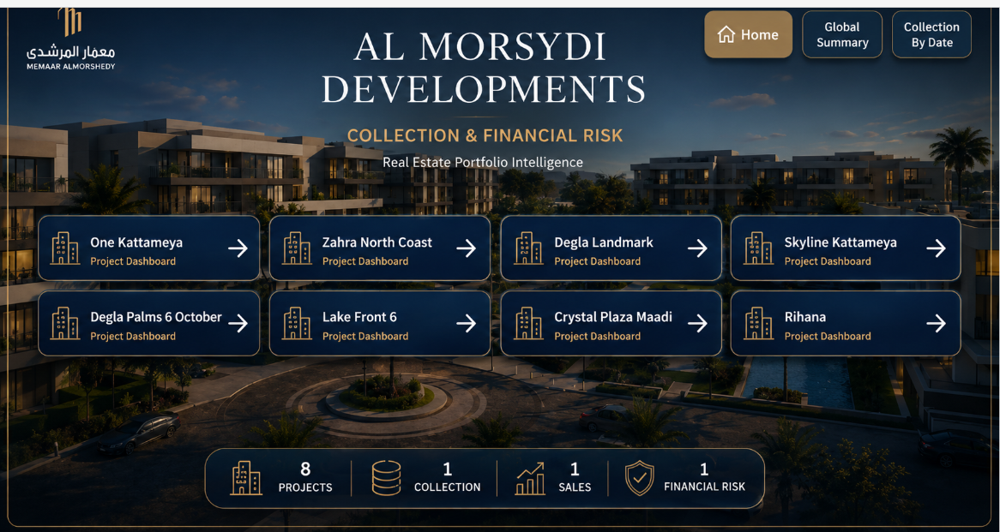
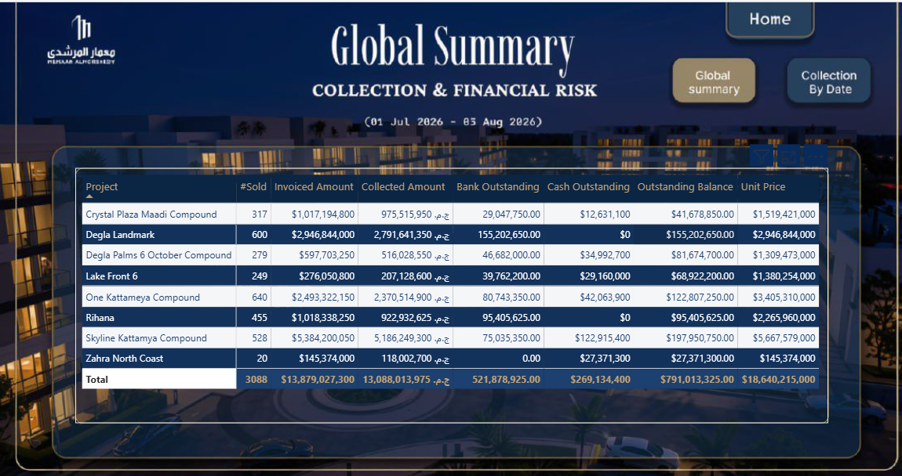
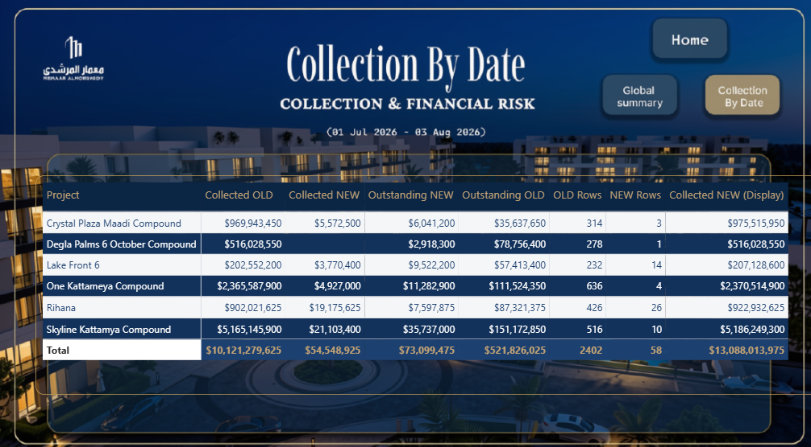
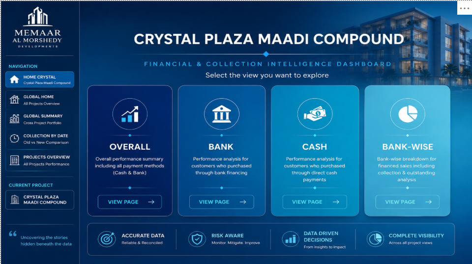
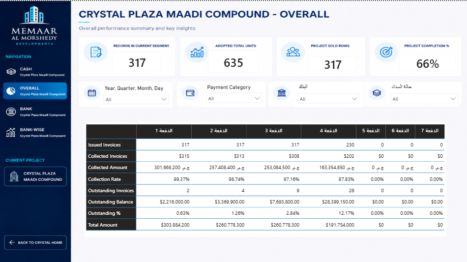
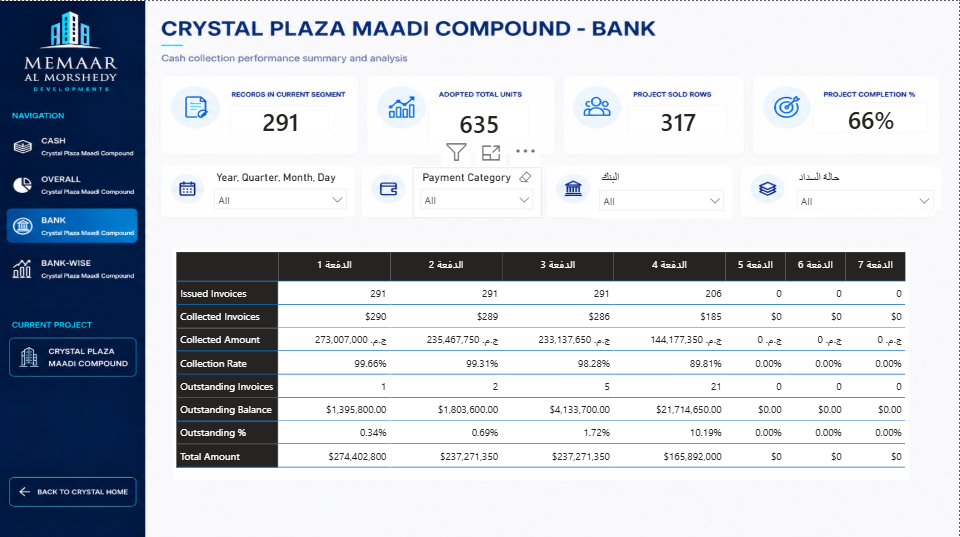
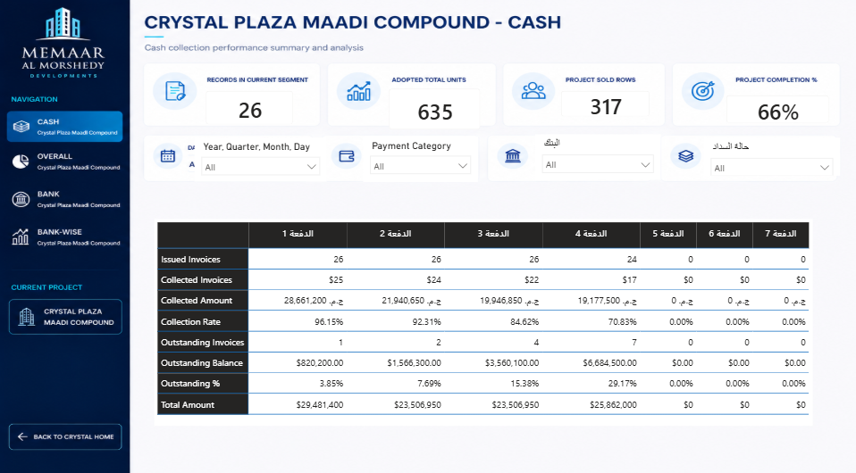
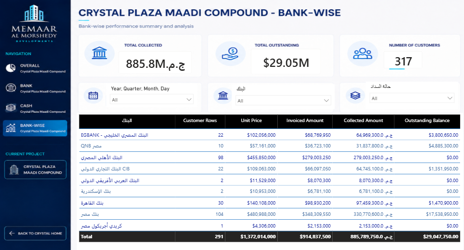

# Al-Morshedy Collection Analysis Dashboard

## 📊 Project Overview

This project is an interactive **Power BI dashboard** developed to analyze collection performance and financial indicators across Al-Morshedy's real-estate projects.

The dashboard provides both **global-level analysis** and **project-level analysis**, helping users monitor collections, outstanding amounts, payment methods, banks, and collection performance.

The project was developed as a **team graduation project by 4 members** as part of the Route Data Analysis program.

---

## 🎯 Project Objectives

The dashboard aims to:

- Monitor collection performance across real-estate projects.
- Analyze collected and outstanding amounts.
- Compare project-level financial performance.
- Analyze collections by payment method.
- Compare **Bank** and **Cash** collections.
- Analyze outstanding amounts by bank.
- Track collection performance over time.
- Provide interactive insights to support data-driven decision-making.

---

## 🏗️ Dashboard Structure

The dashboard is organized into two main levels:

### 1. Global Analysis

- Home
- Global Summary
- Collection By Date

### 2. Project-Level Analysis

Each project includes dedicated pages for:

- Overall Analysis
- Bank Analysis
- Cash Analysis
- Bank-Wise Analysis

---

# 🖥️ Dashboard Preview

## 🏠 Global Home

The main landing page provides navigation to the global analysis sections and available projects.



---

## 📈 Global Summary

Provides an overall view of collection and financial performance across the projects.



---

## 📅 Collection By Date

Provides time-based analysis to monitor collection and outstanding performance.



---

# 🏢 Crystal Plaza Maadi Compound

## 🏠 Project Home

The landing page provides navigation between the project's analytical views.



---

## 📊 Overall Analysis

Provides an overview of the project's collection and financial performance.



---

## 🏦 Bank Analysis

Focuses on collection performance related to bank payments.



---

## 💰 Cash Analysis

Focuses on collection performance related to cash payments.



---

## 🏦 Bank-Wise Analysis

Provides a breakdown of collection and outstanding amounts by bank.



---

# 🏘️ Rihana Project

The repository also includes dashboard views developed for the **Rihana Project**, covering the project's home and analytical pages.

> Rihana dashboard screenshots are available in the `Screenshots` folder.

---

# 📈 Key Analysis Areas

The dashboard focuses on key collection and financial analysis areas, including:

- Collection Performance
- Outstanding Amounts
- Payment Methods
- Bank Collections
- Cash Collections
- Bank-Wise Analysis
- Project-Level Analysis
- Collection Trends Over Time

---

# 🛠️ Tools & Technologies

- **Microsoft Power BI**
- **Power Query** — Data cleaning and transformation
- **DAX** — Calculated measures and business logic
- **Git & GitHub**
- **Git LFS** — Used to store the Power BI `.pbix` file

---

# 👥 Team Project

This dashboard was developed as a **team project by 4 members**.

The project involved collaborative work across different parts of the dashboard and analysis.

## My Contribution

My contribution focused on the dashboard pages and user experience for:

- **Crystal Plaza Maadi Compound**
- **Rihana Project**

My work included:

- Designing project home pages.
- Building project navigation between dashboard sections.
- Creating and organizing project-level views.
- Maintaining a consistent user experience across the pages I worked on.

---

# 📂 Repository Structure

```text
Al-Morshedy-Collection-Analysis-PowerBI/
│
├── PowerBI/
│   └── Collection_Analysis.pbix
│
├── Screenshots/
│   ├── 01-Home.png
│   ├── 02-Global-Summary.png
│   ├── 03-Collection-By-Date.png
│   ├── 04-Crystal-Plaza-Home.png
│   ├── 05-Crystal-Plaza-Overall.png
│   ├── 06-Crystal-Plaza-Bank.png
│   ├── 07-Crystal-Plaza-Cash.png
│   ├── 08-Crystal-Plaza-Bank-Wise.png
│   └── Additional Rihana dashboard screenshots
│
└── README.md